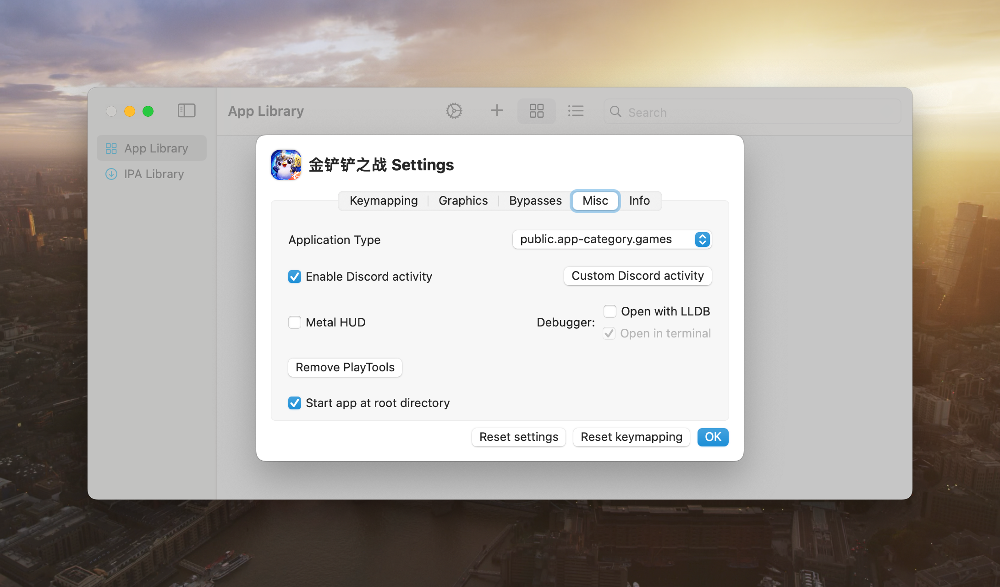
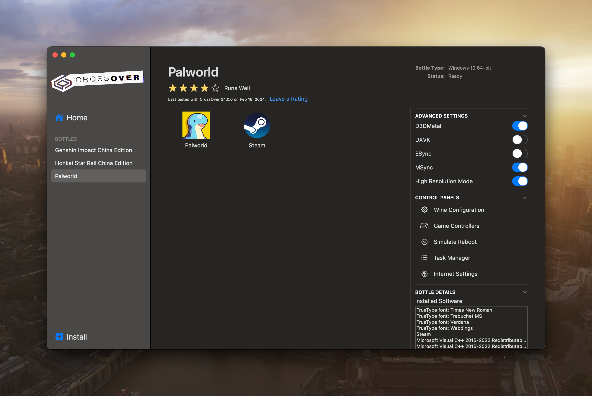
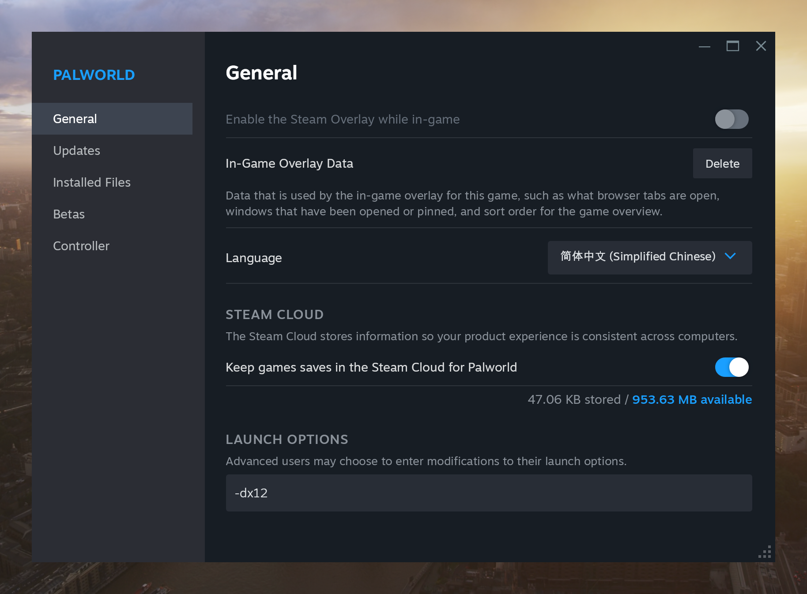

随着今年1月28日[MuMu模拟器Mac(Arm)版](https://mumu.163.com/mac/)的发布，Mac设备上的最后一个平台拼图也被补上，一台Mac设备有着所有平台的运行环境，我也在之前的[博客](../mac-can-be-more)介绍过。普通的生产力环境下，Mac的兼容性可以说是已经相当完善了，那么Mac的游戏能力到底如何呢？

由于我个人玩的游戏比较少，所以没办法给出全面的测试，我只会介绍下我关注的游戏在Mac上的运行情况，更详细的可玩性和特别配置可以关注[AppleGamingWiki](https://www.applegamingwiki.com/wiki/Home)以及YouTube博主[Andrew Tsai](https://www.youtube.com/@Andytizer)和[Andrew Tsai's Tips](https://www.youtube.com/@andrewtsaitips)。

由于[幻兽帕鲁](https://store.steampowered.com/app/1623730/Palworld/)的大火，没有PC设备的我看的也是心痒难耐。索性研究了一下Mac设备的游戏兼容情况，这一研究就延续了基本一整个假期，包括不同运行环境的测试，阅读相应项目的源码，提issue，提pr，与开发者一起测试DEBUG等等，这也就导致虽然是幻兽帕鲁引起的这番折腾，但游戏买了一个月了还没开始玩。

Mac上的游戏运行环境主要分为以下几类：
1. macOS + Arm。这类游戏自然是体验最好的，但相应游戏也比较少，毕竟Mac转向Arm芯片才几年。这类游戏主要是在App Store里的[Apple Arcade](https://www.apple.com/apple-arcade/)订阅提供的，这个订阅里的游戏基本兼容所有Apple设备。当然，也有一些原生兼容的3A大作，比如2023年拿下TGA多项奖项的[博德之门 3](https://baldursgate3.game)，[生化危机：村庄](https://www.residentevil.com/village/us/)，[生化危机4](https://www.residentevil.com/re4/en-us/)，[死亡搁浅：导演剪辑版](https://www.kojimaproductions.jp/en/)以及我一直想玩但还没买的[极乐迪斯科](https://discoelysium.com)。这些属于是Apple转向Arm后用来秀肌肉用的大作了，由此可见，Apple对于自己的游戏生态是相当看重的，甚至其中的一些游戏还推出了iOS/iPadOS版本，一套代码，全平台可用，也是相当吸引开发者了。
2. iOS/iPadOS + Arm。由于Arm芯片的优势，Mac设备可以原生运行iOS/iPadOS的App，这也是基本没有性能损耗的。但是因为开发商的一些限制，很少有iOS/iPadOS游戏发布到Mac App Store上，这也就需要我们使用[PlayCover](https://playcover.io)来安装并运行iOS App。通过这种方式，基本可以运行所有iOS/iPadOS上的游戏，比如[金铲铲之战](https://jcc.qq.com/?ref=bestwebsiterank#/index)等。
3. macOS + x64。前两类游戏是只能运行在Arm版本的Mac上的，而这类是x64版本的Mac上体验最好的游戏，而在Arm上需要通过[Rosetta 2](https://support.apple.com/zh-cn/HT211861)转译，有一定的性能损失。这类游戏包括[英雄联盟](https://www.leagueoflegends.com/en-us/)(随着东南亚服即台服回归拳头公司管理，除了国服之外的其他服务器都有Mac版本。so，tx，nmsl)以及Steam上兼容Mac的大部分游戏，比如[雀魂麻将](https://store.steampowered.com/app/1329410/MahjongSoul/)等等。
4. Windows + x64。这类游戏又可以分为通过[CrossOver](https://www.codeweavers.com/crossover)/[Wine](https://www.winehq.org)运行和通过[Parallels](https://www.parallels.com)运行。除了Mac兼容/虚拟Windows的性能损耗之外，Arm版的Mac还包括Rosetta 2/[Windows的x64仿真](https://learn.microsoft.com/zh-cn/windows/arm/apps-on-arm-x86-emulation)带来的性能损耗。这类游戏包括[原神](https://ys.mihoyo.com)，[崩坏：星穹铁道](https://sr.mihoyo.com)，[英雄联盟](https://www.leagueoflegends.com/en-us/)(18.7补丁之前)，幻兽帕鲁，[双人成行](https://www.ea.com/games/it-takes-two)等等。
5. Android + Arm。通过文章开头介绍的MuMu模拟器Mac(Arm)版，可以玩Android系统的游戏，显然有模拟Android系统的性能损耗，但是我没有进行详细的体验，毕竟能原生运行iOS/iPadOS版本的游戏，而一般而言iOS/iPadOS版本要比Android版本的画质体验好。个人认为应用场景主要是国内手游的非官服版本，比如原神的B服，阴阳师的百度服等等，以及一些安卓平台独有的游戏。
6. Windows + Arm / Linux + x64 / Linux + Arm。查无此游。由于作为游戏平台过于小众，我不太清楚这些平台有什么独有的游戏，假如有的话，一定有上面提到的某一个版本。如果实在感兴趣，Windows + Arm平台可以关注下[Windows ARM software](https://armrepo.ver.lt)网站列出的游戏，Linux平台可以关注下[SteamOS](https://store.steampowered.com/steamos)的发展。
7. 云游戏。这和Mac系统关系不大，使用自己常用的平台即可，不进行过多描述。

接下来就介绍下前文提到的几种软件的使用方法：

+ PlayCover:

	Mac运行iOS/iPadOS App是Apple Silicon发布以来就有的功能，起初是可以随意安装的，但后来Apple提高了限制，只能通过App Store安装。而App是否上架Mac App Store仅仅是开发商发布App时的一个设置，对于游戏这种体验要求很高的App，一般来说开发商不会选择上架。因此，PlayCover应运而出，给了Mac侧载其他iOS/iPadOS App的可能。

	(2024年2月20日备注)需要安装[夜间构建版本](https://nightly.link/playcover/playcover/workflows/2.nightly_release/develop)。
	
	也可通过HomeBrew安装:
	
	```shell
	brew tap PlayCover/playcover
	brew install --cask playcover-nightly
	```
	
	然后在[decrypt.day](https://decrypt.day)网站下载游戏的IPA，手动安装。也可以导入decrypt.day的[IPA源](https://decrypt.day/library)，或者创建自己的库来方便安装以及更新。需要注意的是，比较热门的游戏（例如原神，崩坏：星穹铁道）通过IPA源安装会失败，这是因为Google Drive的文件下载量太大的情况会拒绝访问，这种情况下需要手动在网站上选择OneDrive/Dropbox源下载。
	
	由于安装的是iOS/iPadOS版本，游戏是针对触屏设备进行设计的，也就没有键盘支持。对于支持手柄的游戏，可以直接连接手柄开始游戏。如果需要键盘支持，则需要键位映射，可以去[Github仓库](https://github.com/PlayCover/keymaps)或[Discord频道](https://discord.gg/RNCHsQHr3S)下载现有的键位映射，也可以自行创建。部分游戏（例如原神）不同的键位映射支持的纵横比是不同的，可以根据需求使用对应的键位映射或者更改游戏的纵横比。
	
	PlayCover的当前版本在更改App设置后，有时会出现App未验证的情况，这种情况下更改一下应用类别即可，游戏可改为"public.app-category.games"。
	
	
	
+ CrossOver/Wine

	Wine是一个运行Windows应用的兼容层，也被Valve用于SteamOS上。CrossOver是为不同平台下Windows应用提供额外兼容性而对Wine进行修改的商业软件。
	
	Apple在[WWDC23](https://developer.apple.com/cn/wwdc23/)上推出的[游戏移植工具包(GPTK, Game porting toolkit)](https://developer.apple.com/games/)就是基于CrossOver修改的，并为macOS上的Wine带来了DirectX 12的支持。PlayCover的开发者也在第一时间开发了GPTK的免费开源图形化界面软件[Whisky](https://github.com/Whisky-App/Whisky)。
	
	通过CrossOver/Wine使用Windows App的基本流程是：
	1. 创建Bottle(WINEPREFIX)。Bottle相当于是Windows的运行环境，里面有注册表，C盘等常见的Windows文件。CrossOver推荐不同的App安装到不同的Bottle中，防止不同的运行环境互相干扰；也有研究说不同的App安装到同一个Bottle中会安装多版本的运行时库，使运行环境更鲁棒，这个可以根据个人喜好自行采用。
	2. 设置Bottle。推荐优先尝试如图所示的设置。打开D3DMetal(Whisky默认使用，不用手动打开)，MSync，High Resolution Mode(Retina Mode)。如果游戏无法正常运行或者体验较差，可尝试其他设置。
			
	3. 运行安装程序/应用程序/EXE文件。在Bottle中运行EXE文件，和Windows系统下是完全一样的，可以去网络上自行下载所用App的Windows版本文件。如果是安装程序，则安装到C盘。在创建桌面快捷方式后，则可以在图形化界面方便的打开。如果是可移植版本的应用程序，可打开C盘目录，自行复制到C盘下，并使用运行命令的方法运行，可以保存为快捷方式，方便打开。
	4. (推荐，可选)安装Core Fonts（CrossOver搜索或者winetricks）。
	5. (代理，可选)网络设置中，配置代理为127.0.0.1:代理端口号。

	具体的游戏还有不同的设置：
	1. 幻兽帕鲁。在Steam的属性设置的运行选项中添加-dx12。会使用DirectX 12运行游戏，性能更好。还可以使用[Mod](https://www.nexusmods.com/palworld/mods/27/)，进一步改善性能。
	
	2. 原神。如果需要4.4版本新增的角色动态高精度功能，需要使用DXVK，并进行额外的配置。可自行搜索信息或私信联系我。
	3. 崩坏：星穹铁道。由于该游戏的反作弊系统与Wine不兼容，无法直接运行。需自行搜索信息或私信联系我，也可使用Parallels安装并正常运行。
	4. 米家游戏也有更方便的启动方式，同样需自行搜索信息或私信联系我。

+ Parallels
	
	作为功能最为完备的商业虚拟机软件，同时也是微软唯一认可的在Mac上运行Windows的软件，使用简洁明了，不做过多介绍。附上一些改善游戏性能的[设置](https://www.applegamingwiki.com/wiki/Parallels)。
	
随着各大3A大作登陆Mac设备，甚至iPhone/iPad设备，Apple生态下的游戏环境肯定会越来越好。并且随着Apple Vision Pro的发展，各大游戏厂商也不会错过空间计算的游戏市场，水果忍者已经推出了原生适配版本，崩坏：星穹铁道也以兼容版本登陆，未来也会推出原生适配版本。Apple的游戏生态正处于百家齐放的时代，一套代码部署到多个平台的优势是不可小觑的。所以，Mac，游戏，启动！