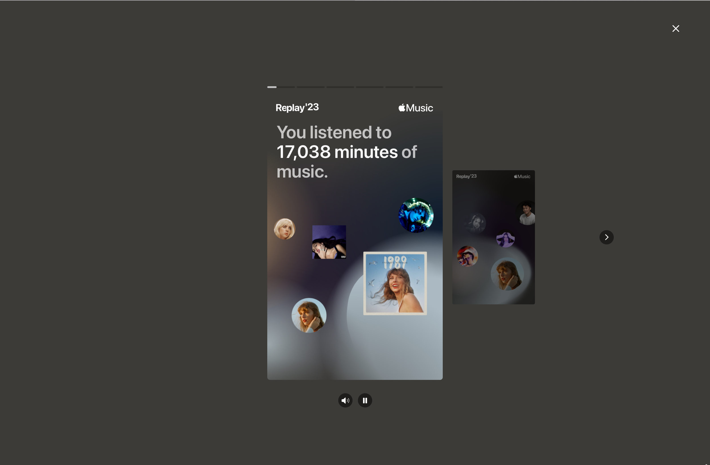
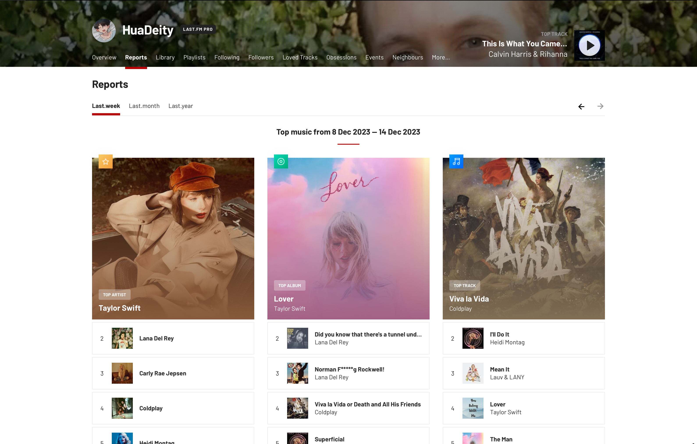
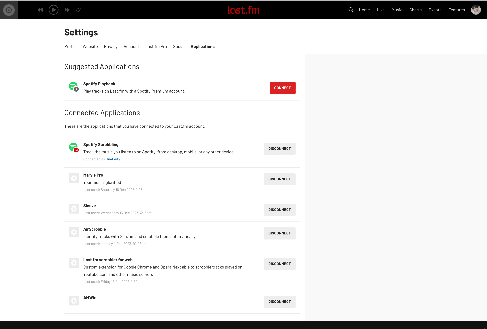
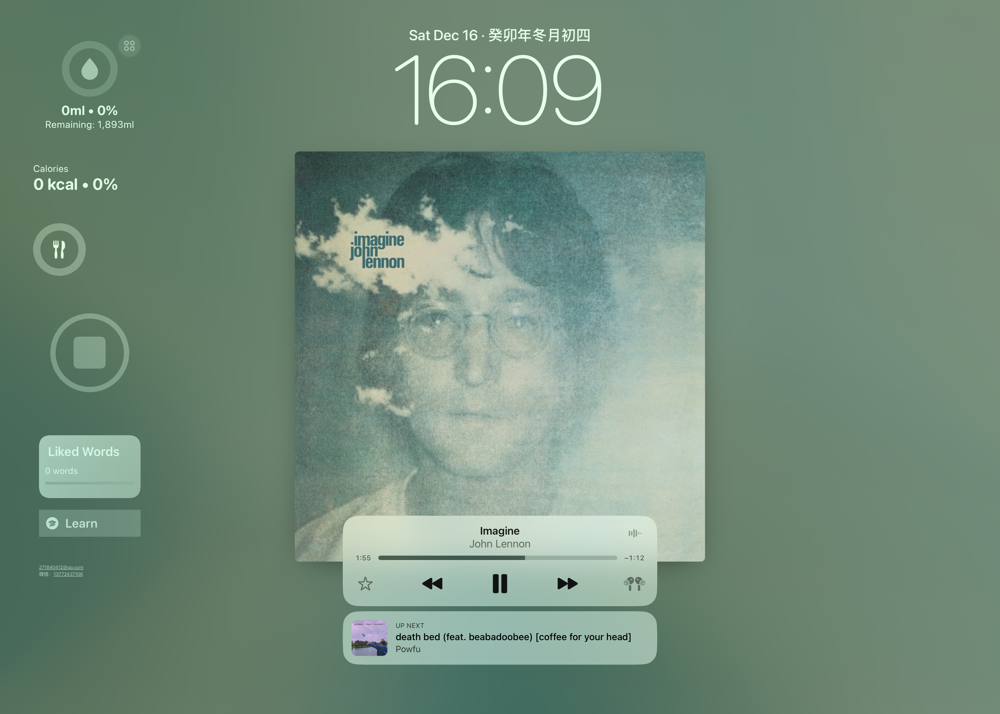
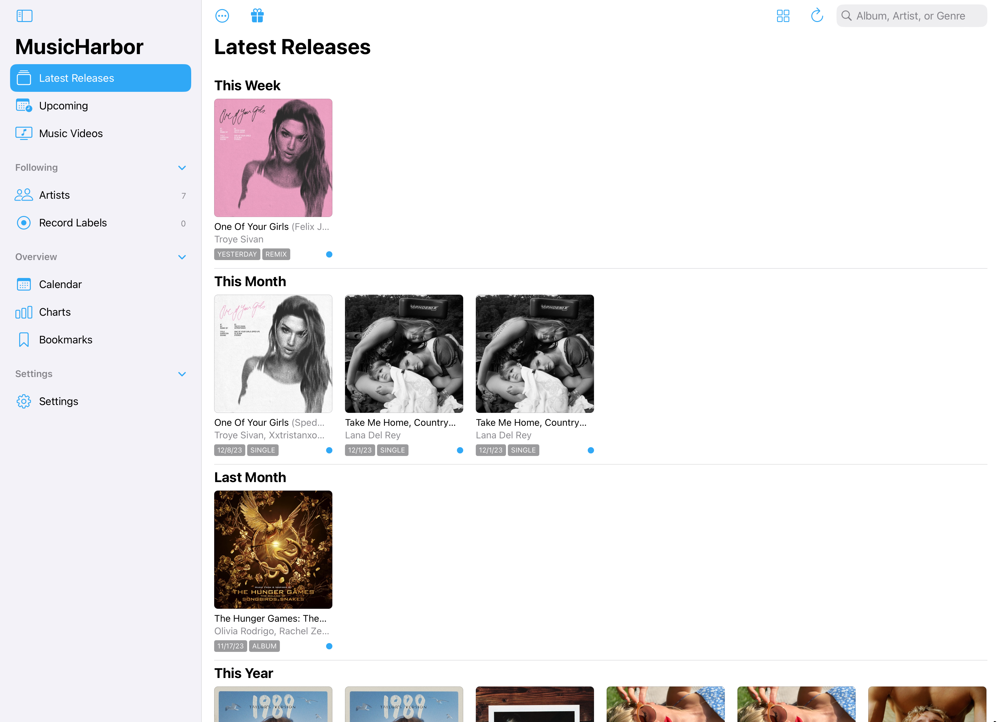
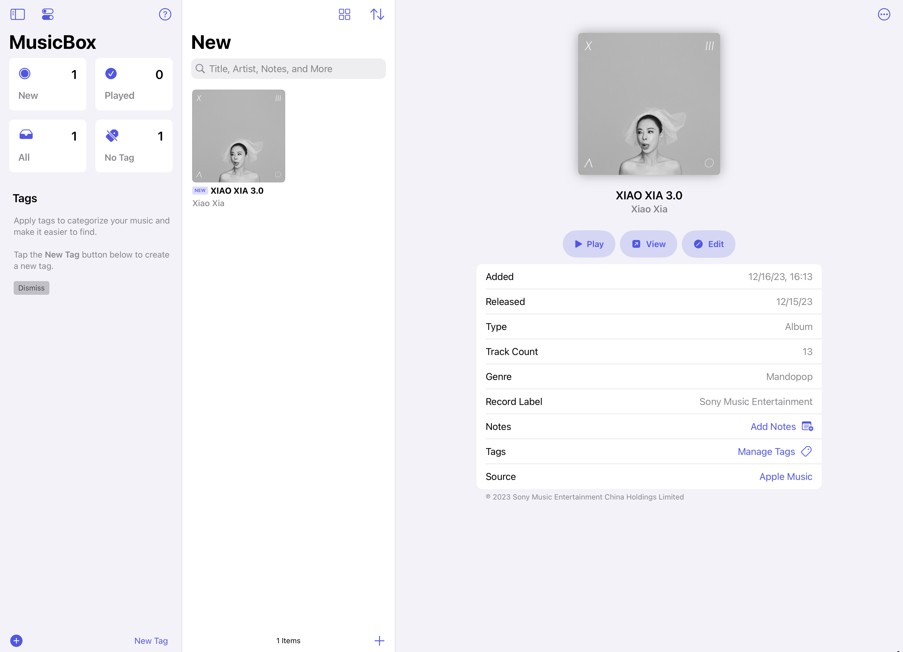
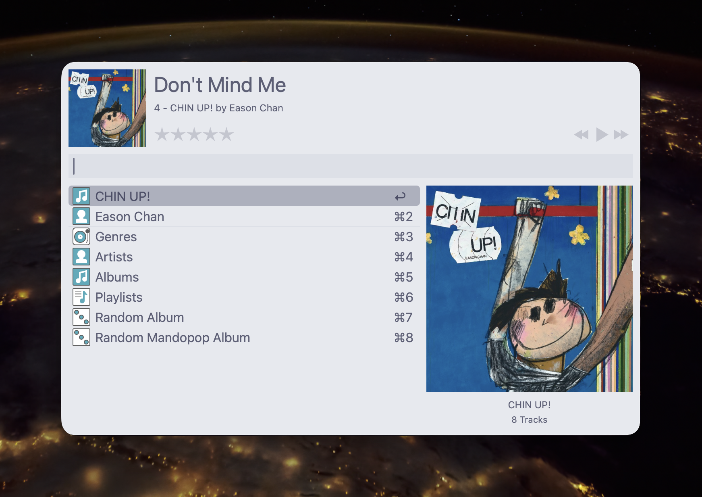

到了年底，各种年度总结纷至沓来，工作有**年度总结**，记录生活有**抖音年度记录**，视频平台有**B站年度弹幕**，甚至启动器应用[Raycast](https://www.raycast.com)也有**Raycast Wrapped**来展示Raycast年度使用情况。

而日常生活不可或缺的音乐自然也少不了年度总结，[**Apple Music Replay**](https://replay.music.apple.com)、[**Spotify Wrapped**](https://newsroom.spotify.com/2023-11-29/wrapped-user-experience-2023/)、以及网易云音乐、QQ音乐都在这个时间段推出了各自平台的年度报告，让我们可以轻松的了解到自己的音乐偏好。但是假如我们使用了多个平台，或者有一些喜欢的本地音乐，这些平台的报告是不能覆盖我们所有的听歌情况的，所以我推荐使用[**Last.fm**](https://www.last.fm)来记录(Scrobble)我们的听歌情况，获得更完善的音乐报告。Last.fm的详细介绍我会放到后面，先来介绍下我是怎么选择音乐流媒体服务的。

## 服务
我个人更推荐使用海外的音乐流媒体服务，例如[Apple Music](https://music.apple.com)和[Spotify](https://www.spotify.com)。当然如果喜欢的歌曲多是小众华语，还是选择国内的服务更省心一些。那么海外音乐流媒体服务有哪些优势呢：
+ **版权完善**
	
	由于国内的数字版权管理还不完善，经常出现音乐在一个服务平台可听，但在另一个服务平台不可听的问题，也就是独家版权的问题。国内的版权基本上被网易云音乐和QQ音乐两家所分，想要获得完整的曲库，至少需要使用，甚至订阅两个平台。海外服务平台则很少出现独家版权的情况。
+ **一次付费**

	使用国内平台对于数字专辑的概念应该是比较熟悉的，这是一个在订阅之外额外付费的产物，也是国内平台独有的产品。这起初是因为国内平台订阅价格较低而需要对费用较高的专辑额外收费，但随着订阅价格逐年变高，这种收费制度则愈发显得不合理。它也进而导致了数字专辑刷榜的情况，国内平台大赚特赚。海外平台则是订阅之后就可以听所有音乐。
+ **功能专一**

	国内平台充斥着广告、直播、短视频、打赏等服务，我用这个平台只是为了听音乐，而不需要其他任何服务。网易云音乐云村的社交过去广受好评，但随着使用人数的增多，这种社交也变得繁杂起来。海外平台则专注于听歌，没有其他无用的功能。
+ **集成友好**

	国内平台的第三方集成相对较少，换句话说，平台的掌控度高，各种服务都是由平台本身提供，而提供给第三方开发者的API较少，这种情况有利有弊，好处是有些功能是本身就有的，坏处是少了很多扩展的可能性。而海外平台有着众多的第三方应用提供个性化的体验。
+ **界面美观**

	这个方面见仁见智，个人觉得国内平台界面较为臃肿繁杂。

但也有些不足：
+ 小众华语曲库较小。一些小众的歌曲没有出海的打算，自然就没有发布到海外的平台。
+ 社交需求。身边的朋友可能还是用网易云音乐这种较多，海外平台的社交属性较低。

除此之外，海外平台Apple Music和Spotify也各有优势：

[Apple Music](https://music.apple.com):

+ 易于访问
+ 无损音频和杜比全景声，Apple的资源来自于母带，音质可以说是最好的
+ 更好的Apple设备集成，例如AirPods空间音频和Mac键盘播放快捷键。
+ 价格便宜，国区个人11元，学生5元(秒杀一众国内平台)
+ 歌词体验良好，有实时同步歌词
+ 资料库模式，专辑导向的音乐管理
+ 音乐视频，MV与音乐一同管理
+ [Apple Music Sing](https://www.apple.com.cn/newsroom/2022/12/apple-introduces-apple-music-sing/)，卡拉OK模式
+ [Apple Music Classical](https://support.apple.com/zh-cn/HT213415)，古典音乐专属音乐平台(可能需要外区账号)

[Spotify](https://www.spotify.com):

+ 曲库完整，由于国区Apple Music的价格与版权问题，曲库并不完整，国内的一部分版权是来自于QQ音乐的。Spotify没有国区，自然没有相应问题。外区的Apple Music的曲库也是完整的。
+ 缓存问题。由于Apple Music账号与App Store账号绑定，假如切换App Store账号会导致Apple Music删除缓存。Spotify独立与Apple ID，也就没有相应问题。
+ 算法精准。Spotify的推荐算法是一流的，非常适合发现新音乐，探索自己的音乐世界。
+ [Spotify Connect](https://connect.spotify.com/)，跨设备音乐控制及同步，当前设备播放时可以用其他设备进行控制，并且切换设备时可以同步播放进度和播放列表，与AirPods的自动切换设备搭配起来体验极其舒适。

## Scrobble
这里就到了开头提到的Scrobble部分了，简而言之就是自动记录当前播放的音乐。这里需要用到的服务就是[Last.fm](https://www.last.fm)，服务本身完全免费，当然也可以$3/mo订阅Pro支持一下。据我所知，应该没有其他类似的服务了。只有这么一个服务平台是不够的，还需要Scrobbler，用来连接我们使用的流媒体服务甚至是本地音乐。不同的平台自然要使用不同的Scrobbler，接下来就介绍下常用的平台对应的Scrobbler:

### [Spotify](https://www.spotify.com)
Spotify的第三方集成做的相当出色，可以[一键连接](https://www.last.fm/settings/applications)，只需要将Last.fm账号与Spotify账号连接即可。

### [Apple Music](https://music.apple.com)
Apple Music没有这种一键式的设置，需要在播放设备上下载额外的Scrobbler进行记录才行。不同平台可用的Scrobbler还有些不同。
#### iOS/iPadOS
+ [Marvis Pro](https://appaddy.wixsite.com/marvis)

	出色的第三方Apple Music播放器，提供简洁可定制化的UI以及更方便的操作。
	

+ [Longplay](https://longplay.rocks)

	另一个第三方Apple Music播放器，提供设置连续播放专辑的功能。

虽然这些是播放器，但是播放源依然是[音乐](https://apps.apple.com/us/app/apple-music/id1108187390)app，播放器仅与其交互，也就是说，没有音乐app，第三方播放器是无法使用的。
#### macOS
+ [Sleeve](https://replay.software/sleeve)

	桌面音乐小组件，可以通过悬浮窗的形式显示当前播放音乐的专辑图片，歌曲名，歌手等信息，可自定义UI，并可以在Dock栏显示“正在播放”。支持Apple Music，Spotify，和[Doppler](https://brushedtype.co/doppler/)等平台。
	

+ [NepTunes](https://neptunesmac.app)

	另一个桌面音乐小组件，除了悬浮窗之外还为Spotify提供音乐播放通知。支持Apple Music和Spotify。
#### Windows
+ [AMWin-RP](https://github.com/PKBeam/AMWin-RP)

	为[Apple Music Preview](https://apps.microsoft.com/detail/9PFHDD62MXS1?hl=zh-cn&gl=CN)提供Discord Rich Presence和Last.fm支持。

### Others
海外的其他音乐流媒体服务平台也有相对应的Scrobbler，大家可以去[相应网站](https://www.last.fm/about/trackmymusic)了解。

国内的音乐流媒体服务平台基本没有集成良好的Scrobbler，但也可以通过其他方法，例如浏览器扩展或者听歌识曲实现。
+ [Web Scrobbler](https://web-scrobbler.com)

	一个浏览器扩展，基本上支持所有流媒体平台，在网页听歌时提供Scrobble功能。
+ [AirScrobble](https://airscrobble.com)

	基于[Shazam](https://www.shazam.com)(Apple设备内置的听歌识曲应用)的Scrobbler，不仅可以记录身边播放的音乐还可以通过[ShazamKit](https://developer.apple.com/cn/shazamkit/)自动识别记录设备上当前播放的音乐，所以可以支持所有流媒体平台。
	
## 小组件
Apple平台提供了出色的桌面小组件个性化设置，在最新的系统版本中还添加了可交互的小组件，并将桌面小组件带到了macOS平台。通过桌面小组件可以让音乐在生活中随处可见。
+ [谜底黑胶 | MD Vinyl](https://apps.apple.com/us/app/md-vinyl-music-widget/id1606306441)

	国内知名独立开发者[61](https://61.life)的[谜底科技工作室](https://bento.me/mdstudio)打造的音乐小组件，体验“正在播放”音乐小部件的美丽，并为您的主屏幕注入新的活力。支持Apple Music和Spotify。[开发者指出](https://x.com/liuyi0922/status/1519298175894388736?s=20)，网易云音乐的黑胶小组件就是源自该App。
	
+ [WidgetPod](https://apps.apple.com/us/app/widgetpod/id1547172403)

	由上文提到的[Marvis Pro](https://appaddy.wixsite.com/marvis)开发者[Aditya Rajveer](https://twitter.com/AdityaRajveer)打造的音乐小组件，与谜底黑胶功能类似，同样是“正在播放”音乐小组件。支持Apple Music和Spotify。
	
+ [LivePod](https://apps.apple.com/us/app/livepod/id6464291295)

	开发者[Aditya Rajveer](https://twitter.com/AdityaRajveer)的另一款音乐组件，通过实时活动显示下一首歌曲，支持Apple Music，[Marvis Pro](https://appaddy.wixsite.com/marvis)中已有该功能。

+ [Widgetsmith](https://david-smith.org/apps/)

	由独立开发者[David Smith](https://www.david-smith.org/about/)打造的小组件集合App，可以说是功能最强大的小组件集合App了。在最新的版本中加入的音乐集合可交互小组件，将可交互小组件的功能发挥的淋漓尽致，实现了令各大开发者称赞的动效，且该小组件是免费的。
	

	
## 歌词
歌词也是音乐中很重要的一部分，国内平台在macOS上提供了菜单栏控制，菜单栏歌词，桌面歌词等国内平台常见的功能，但是海外平台没有这些功能。而且Spotify的歌词体验实在一般。本地音乐以及一些小众音乐也有缺失歌词的问题。有一个可以提供歌词的App显得尤为重要。目前市面上已经有一些提供相应功能的组件：
### iOS/iPadOS
+ [musixmatch](https://www.musixmatch.com)

	可以搜索歌词，也可以在App中看到正在播放的歌词。支持Apple Music和Spotify。
	
### macOS
+ [LyricsX](https://github.com/ddddxxx/LyricsX)

	菜单栏歌词，桌面歌词，悬浮窗歌词等。支持Apple Music和Spotify以及一些本地播放器，例如Vox。
	
### Spotify

+ [Spicetify](https://spicetify.app)

	一个桌面端Spotify的插件，使得Spotify客户端完全可定制化，自由开关各种功能，更改主题，更强大的搜索以及歌词功能。
+ [Spotify Lyrics](https://github.com/mantou132/Spotify-Lyrics)

	浏览器扩展，为网页端Spotify带来悬浮窗歌词。支持Chromium和Firefox。

但是这些App都有多多少少的限制，[musixmatch](https://www.musixmatch.com)需要订阅且歌词源较少，[LyricsX](https://github.com/ddddxxx/LyricsX)已经多年没有更新，Spotify的组件只支持桌面端和浏览器扩展等等。没有一个可以覆盖所有的应用场景。

因此，我个人有构建一个歌词App的想法，但因为种种因素，还没有新建文件夹，希望明年可以实现。

## 其他
除了上述分类具体的App之外，还有一些好用的App来提高音乐生活的品质。
+ [Shazam](https://www.shazam.com)

	听歌识曲，并将识别到的歌曲添加到播放器的资料库，支持Apple Music和Spotify。
+ [iTunes Remote](https://apps.apple.com/us/app/itunes-remote/id284417350)

	从iPhone/iPad/Apple Watch控制桌面端音乐App。
+ [MusicHarbor](https://marcosatanaka.com)

	由独立开发者[Marcos Tanaka](https://marcosatanaka.com)打造，帮助您随时了解您最喜欢的艺术家和唱片公司的新音乐发布、音乐视频、活动和新闻。支持从Apple Music，Spotify和Last.fm导入，也可以手动在App中搜索。
	

+ [MusicSmart](https://marcosatanaka.com)

	同样由独立开发者[Marcos Tanaka](https://marcosatanaka.com)打造，搜索音乐专辑、歌曲和艺术家的唱片内页和制作人员名单，可以深入了解你最喜爱音乐的创作过程。支持Apple Music和Spotify。
	

+ [MusicBox](https://marcosatanaka.com)

	同样由独立开发者[Marcos Tanaka](https://marcosatanaka.com)打造，和文章有“稍后读”一样，音乐也有“稍后听”，可以用于专辑、歌曲、艺术家、播放列表和广播电台。将新音乐保存到稍后听列表中，整理和组织喜爱的音乐，添加标签、注释、元数据等信息。支持Apple Music和Spotify。
	

	
+ [Background Music](https://github.com/kyleneideck/BackgroundMusic)

	macOS音频组件，已多年没有更新，有Bug，自动暂停音乐，设置单独应用的音量并记录系统音频(该功能可使用[SoundSource](https://rogueamoeba.com/soundsource/)和[LoopBack](https://rogueamoeba.com/loopback/))。
+ [Mac Media Key Forwarder](https://github.com/quentinlesceller/macmediakeyforwarder)

	macOS媒体键转发器，Spotify作为主要音乐播放器时很有用，支持Apple Music和Spotify。
+ 启动器集成

	通过键盘快速控制播放器。

	[Alfred](https://www.alfredapp.com)原生集成Apple Music，可通过[Spotify Mini Player](https://alfred.app/workflows/vdesabou/spotify-mini-player/) Alfred Workflow集成Spotify。
	
	[Raycast](https://www.raycast.com)通过安装扩展[Music](https://www.raycast.com/fedevitaledev/music)和[Spotify Player](https://www.raycast.com/mattisssa/spotify-player)以及[Spotify Controls](https://www.raycast.com/thomas/spotify-controls)集成Apple Music和Spotify。
	

## 本地音乐
以上说的都是在线音乐流媒体服务平台，但是本地音乐显然也是日常音乐构成的一部分。而且使用相同的播放器来听歌可以有更统一的使用体验，我们可以将所使用流媒体平台曲库中没有的歌曲通过本地音乐的形式导入到所用的播放器中，来达到这个目的。那么怎么将本地音乐融入到我们的音乐配置中呢？

### 管理
我推荐通过Apple Music资料库(iTunes)来进行统一管理。使用Apple Music资料库并不意味着使用Apple Music，仅仅是用其来进行本地音乐的管理，资料库模式提供的专辑导向的整理形式与现实生活中整理实体唱片的形式类似，可以更好的进行本地音乐的管理。

而且iOS/iPadOS中的本地音乐是必须通过资料库进行同步的，只有通过资料库同步的音乐才会出现在Apple Music，Spotify，网易云音乐等音乐App的本地音乐中。

资料库的同步可以参考[Apple支持](https://support.apple.com/en-us/108311)，也可以订阅Apple Music或iTunes Match来进行[云同步](https://support.apple.com/zh-cn/HT204926)，但是云同步可能会导致音乐音质的降低。

如果想要更专注的本地音乐资料库，可以使用[Doppler](https://brushedtype.co/doppler/)来构建自己的资料库，它也提供了Last.fm支持。

### 获取
有能力的情况下，我还是更推荐通过正版渠道获取本地音乐文件的，所以这里不会包含任何非正版渠道的方式。

小众华语以及独家华语歌曲可使用QQ音乐和网易云音乐的单曲购买和专辑购买功能，这样购买的歌曲下载之后没有DRM保护，也就是不是专用格式，而是通用的MP3和FLAC格式。

海外歌曲可以在[Bandcamp](https://bandcamp.com)和[iTunes Store](https://apps.apple.com/us/app/itunes-store/id915061235)购买。更推荐通过Bandcamp购买无损音质的音乐。

### 导入
获取到歌曲文件后，还需要将歌曲导入到前述的音乐资料库中。由于Apple有专有的无损格式ALAC，与下载到的FLAC的无损格式不同，需要先进行格式转换才能导入到Apple Music资料库中([Doppler](https://brushedtype.co/doppler/)支持FLAC格式)，可以使用[XLD](https://tmkk.undo.jp/xld/index_e.html)(macOS)或[foobar2000](https://www.foobar2000.org)(Windows)进行格式转换。

除此之外，本地音乐文件还有一个特点，就是音频文件元数据，元数据包含了歌手，专辑，作曲家，歌词等歌曲相关的信息。虽然下载下来的歌曲带有了一些基础的信息，但是一般需要更详细的编辑才能满足构建个人资料库的需求。Apple Music资料库和Doppler都带有编辑元数据的功能，前述的无损格式转换App也可以在转换时进行一定的编辑，如果需要更高级的功能，可以在macOS上使用[Mp3tag](https://mp3tag.app)。

导入到Apple Music资料库后，就可以使用一系列支持Apple Music的组件了。

## 总结
综上，我的Music Setup如下：

服务：美区Apple Music(主要)，网易云音乐(社交需求，如果需要的话)

Scrobble: [Marvis Pro](https://appaddy.wixsite.com/marvis)(iOS)，[Sleeve](https://replay.software/sleeve)(macOS)，[AMWin-RP](https://github.com/PKBeam/AMWin-RP)(Windows)

小组件: [WidgetPod](https://apps.apple.com/us/app/widgetpod/id1547172403), [Widgetsmith](https://david-smith.org/apps/)

歌词: N/A

其他：[Shazam](https://www.shazam.com), [iTunes Remote](https://apps.apple.com/us/app/itunes-remote/id284417350), [MusicHarbor](https://marcosatanaka.com), [MusicSmart](https://marcosatanaka.com), [MusicBox](https://marcosatanaka.com), [Alfred](https://www.alfredapp.com)

本地音乐: Apple Music资料库

PS. Spotify个人订阅太贵了，如果有一起家庭订阅的小伙伴，也是想用一下的
